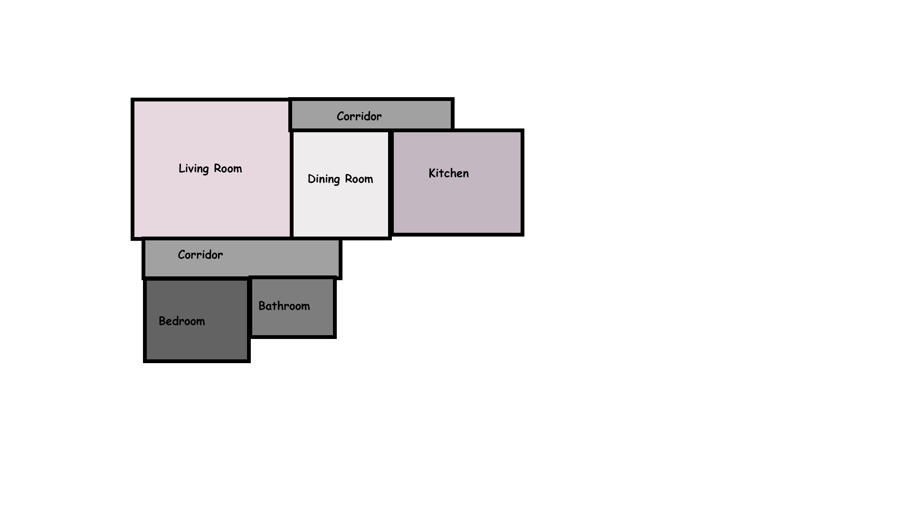
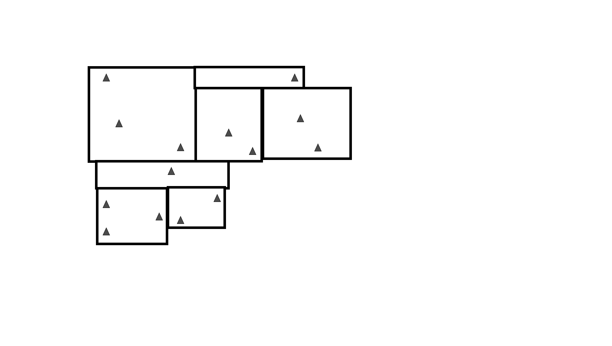
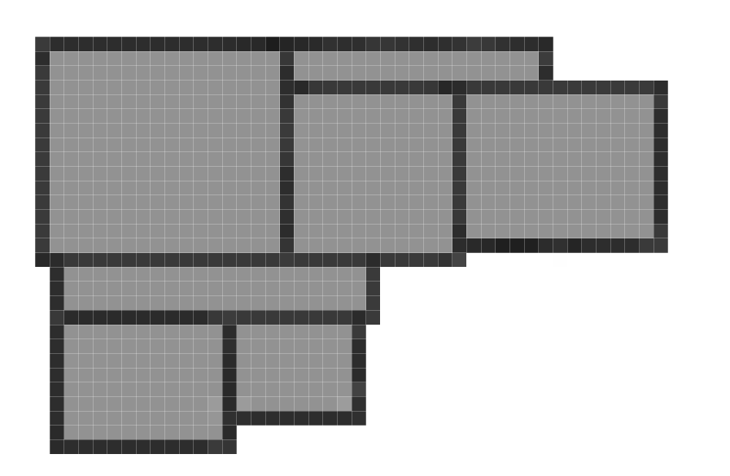
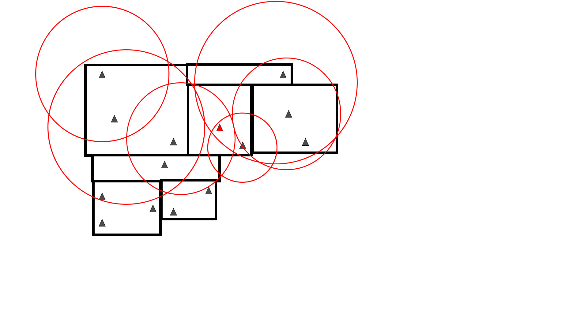
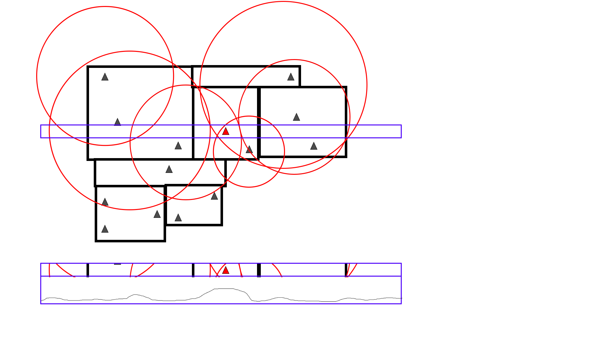

Robotics Assigmnment 2
=====================

Map Generation
==============

Figure 1

Figure 2

Use a variety of rectangles to construct a basic floor plan and assign
each space a room designation. See Figure 1

Object Assignment
=================

Based on the designation of a specific room (i.e kitchen) assign object
such that they are placed according to our desired spatial relational
graph. See Figure 2.

Simultaneous Localisation And Mapping (SLAM)
============================================

Subscribers
-----------

-   Laserscan

-   Particle cloud

Publishers
----------

-   estimated position

-   particle cloud

-   SimpleMap (SM)

Use SLAM as described in the lectures to explore the floor plan and
identify the robot's position, returning an additional SimpleMap that is
a grid representation of the explored floor plan.

Figure 3

Using a 100m x 100m space with a resolution of $0.2m^2$ per grid we end
up with an ndarray of size 500 x 500 to represent our simplified map
using integers to represent the state of each square. 0 means the square
is unknown, 1 means the square is explored but can be driven through and
2 means that it is explored but a wall has been found. See Figure 3.

Object Position eStimation (OPS)
================================

Subscribers
-----------

-   SimpleMap

-   Estimated Position

-   Dict of all seen objects + estimated positions

Publishers
----------

-   location to travel to

Figure 4

Using the generated spatial relational graph the OPS section will
identify the next square the robot will travel to in an attempt to find
the desired object. See figure 4.

Figure 5

All the modeled spatial relations will be used to form a 3d heat map
(see figure 5 for where we estimate the desired object to be.
Then provided that the square can be navigated to as the crow flies from
an explored non wall square the square in question will be published.

In the event the array of objects contains the desired object then it
will be directly navigated to.

Visual Object Detection (VOD)
========================================

Subscribers
-----------

-   objectList

-   Estimated Position

-   Robot Odometry

Publishers
----------

-   Dict of all seen objects + estimated positions

Simulate observing objects and publish the observed objects (store all
observed instances of all objects and cluster to form array of all found
items)

Assignments
===========

-   SLAM: 2 people

-   OPS: 2 people

-   VODs + Navigation 1 person

-   Map Generation + Object Assignment TBD

## Publisher Channel names

- estimated position: `estimated_pose`
- particle cloud: `particle_cloud`
- LaserScan: `base_scan`
- SimpleMap: `map`
- objectList
- Robot Odometry: `odom`
- all seen objs + estimated positions: `known_objects`
- location to travel to (long term goal from OPS): `goal_position`
- target object (published at beginning of episode): `target_object`
